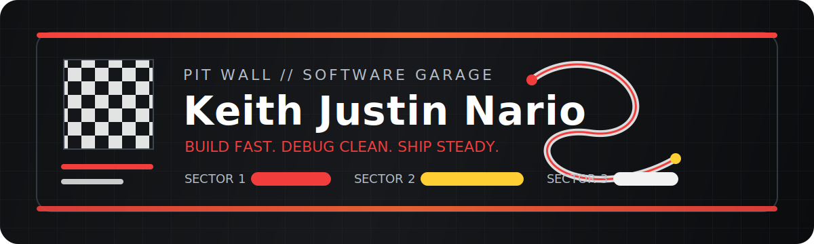
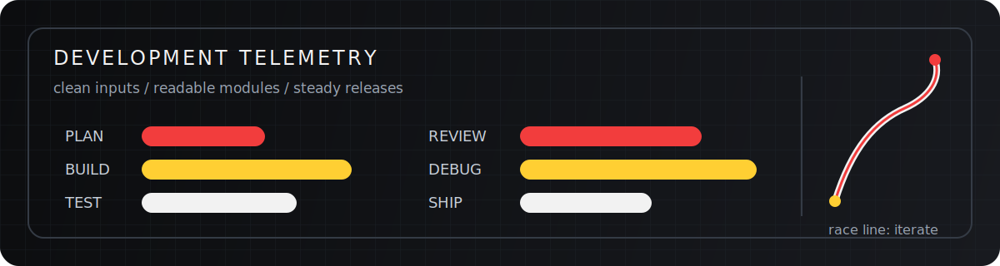

<!--
Profile README notes:
- Create a public repository named exactly like your GitHub username.
- Put this README.md in the root of that repository.
- This design avoids common badge generators, copied icon rows, and official racing logos.
- Keep the stack honest. Delete tools you have not used yet.
-->

<div align="center">
  
</div>

# Keith Justin Nario

I build web apps and APIs with a race-engineering mindset: clean structure, fast
feedback, careful debugging, and steady improvement every lap.

```text
role        software developer
base        Philippines
focus       full-stack web development
style       simple systems, readable code, useful interfaces
```

## Pit Wall

| Signal | Current read |
| --- | --- |
| Now building | Full-stack projects, API workflows, and polished frontend screens |
| Improving | TypeScript habits, backend structure, testing, deployment |
| I like | Clear commits, small iterations, practical features |
| Rule | Make the next change easier than the last one |

## Tech Stack

### Languages and Core

| Track | Tools |
| --- | --- |
| Markup and styling | `HTML` `CSS` |
| Programming | `JavaScript` `TypeScript` `Python` `C++` |
| Runtime | `Node.js` |

### Frontend Garage

| Track | Tools |
| --- | --- |
| UI building | `React` `Next.js` |
| Styling approach | `CSS Modules` `Responsive Layouts` |
| Quality pass | `Accessibility Checks` `Mobile Polish` |

### Backend and Data

| Track | Tools |
| --- | --- |
| Server work | `Express` `REST APIs` |
| Databases | `MongoDB` `MySQL` `Supabase` |
| API testing | `Postman` |

### Ship and Maintain

| Track | Tools |
| --- | --- |
| Version control | `Git` `GitHub` |
| Deployment | `Vercel` `Render` |
| Package flow | `npm` |

## Racecraft

- I break rough ideas into small, buildable parts.
- I read errors carefully before changing code.
- I prefer code that explains itself over code that needs a speech.
- I measure progress by working features, not noise.
- I keep refactoring close to the problem I am solving.

## Telemetry

<div align="center">
  
</div>

```text
plan -> build -> test -> review -> ship
```

## Featured Work

I keep my strongest repositories pinned below this README so visitors can see the
actual code, not just the profile design.

<!--
When you are ready, replace this section with 2-3 real projects:

| Project | What it solves | Stack |
| --- | --- | --- |
| [Project Name](https://github.com/nariokeith/project) | One plain-English sentence. | React, Node.js |
-->

## Contact

Best place to reach me: [@nariokeith](https://github.com/nariokeith)

---

<div align="center">

```text
CHEQUERED FLAG: reliable laps beat noisy dashboards.
```

</div>
